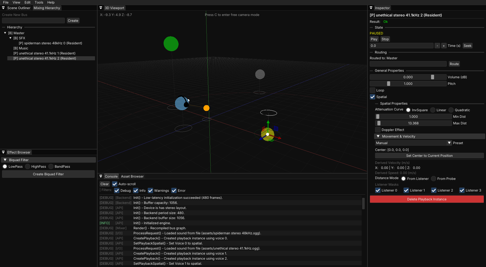

<div align="center">
  
  <br><br>
  <i>Dedicated Abstraction Layer for Interactive Audio in C++</i>
</div>

---

## Features
* **Configurable Memory Usage:** All internal pools are pre-allocated at startup per configuration. No dynamic allocations at runtime.
* **Asset Management:** Asynchronous, reference-counted asset loading and double-buffered OGG/Vorbis streaming.
* **3D Spatialization:**
  * Configurable coordinate systems (left/right-handed).
  * Multi-listener support with bitmask routing (for split-screen/local co-op).
  * Distance probes (split distance-attenuation and panning origins for 3rd-person cameras).
  * Doppler shifting with global and per-playback scaling.
* **Dynamic Mixing Hierarchy:**
  * Directed acyclic graph bus routing.
  * 4 hot-swappable DSP effect slots per bus.
* **Real-Time Playback Parameter Control:** Volume, pitch, pan, looping, spatialization, position, attenuation curve, min/max distance, velocity, doppler effect, and more.

DALIA is currently only supported on Windows (WASAPI).
Check out the [documentation](https://amhumming.github.io/dalia/) for more details.

## The Demo
DALIA includes a standalone sandbox application designed to showcase and test the engine's features. If you want to
test what the engine is capable of without having to write any code you can try it out by following the build
instructions provided below and running the compiled demo executable.

<p align="center">
  
</p>

## Building from Source

### Requirements
* CMake 3.20+
* Compiler with C++20 support

If you want to compile DALIA directly to run the Demo or Studio UI, use the commands below. Note that DALIA Studio tool
is currently not in a usable state.

```bash
git clone https://github.com/amHumminG/dalia.git
cd dalia

cmake -B build
cmake --build build --config Release
```

*The compiled executables will be located in the `/build` directory*

## Integration
DALIA automatically detects when it is built as a subproject and will exclude the demo and studio applications from the 
build.

**Via FetchContent:**
```cmake
include(FetchContent)
FetchContent_Declare(
    dalia
    GIT_REPOSITORY https://github.com/amHumminG/dalia.git
    GIT_TAG main
)
FetchContent_MakeAvailable(dalia)

target_link_libraries(YourTarget PRIVATE dalia::engine)
```

**Via Git Submodule:**
```cmake
add_subdirectory(third_party/dalia)
target_link_libraries(YourTarget PRIVATE dalia::engine)
```

## License
DALIA is licensed under the [MIT License](LICENSE).

## Acknowledgements

The core engine relies on a single public-domain header:
* [stb_vorbis](https://github.com/nothings/stb) for OGG/Vorbis decoding.

The Demo and Studio applications are built using the following open-source projects:
* [raylib](https://github.com/raysan5/raylib) (zlib License)
* [Dear ImGui](https://github.com/ocornut/imgui) (MIT License)
* [rlImGui](https://github.com/raylib-extras/rlImGui) (zlib License)
* [ImGuizmo](https://github.com/CedricGuillemet/ImGuizmo) (MIT License)

*(Note: These UI and rendering libraries are excluded from your build when DALIA is linked as a subproject).*