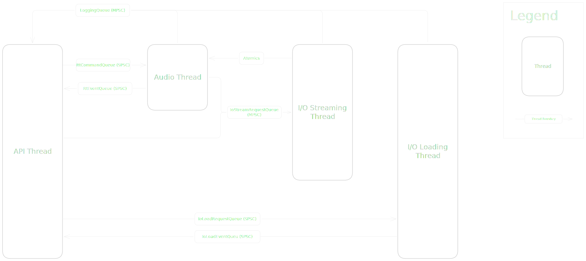
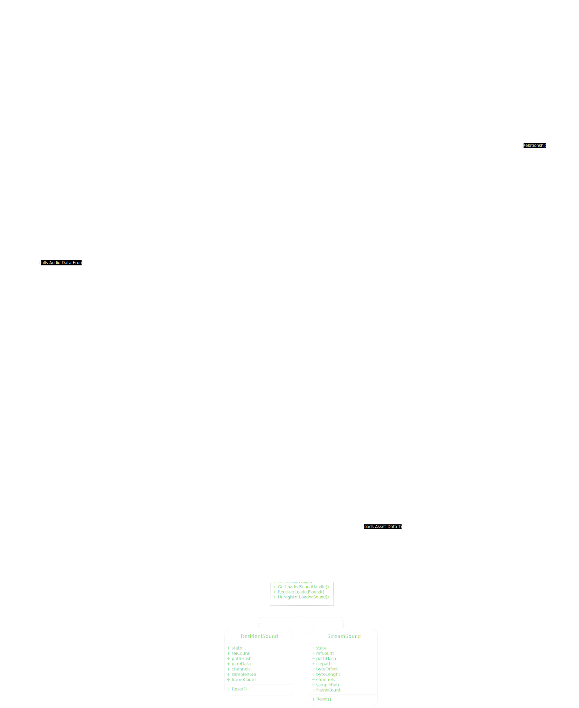
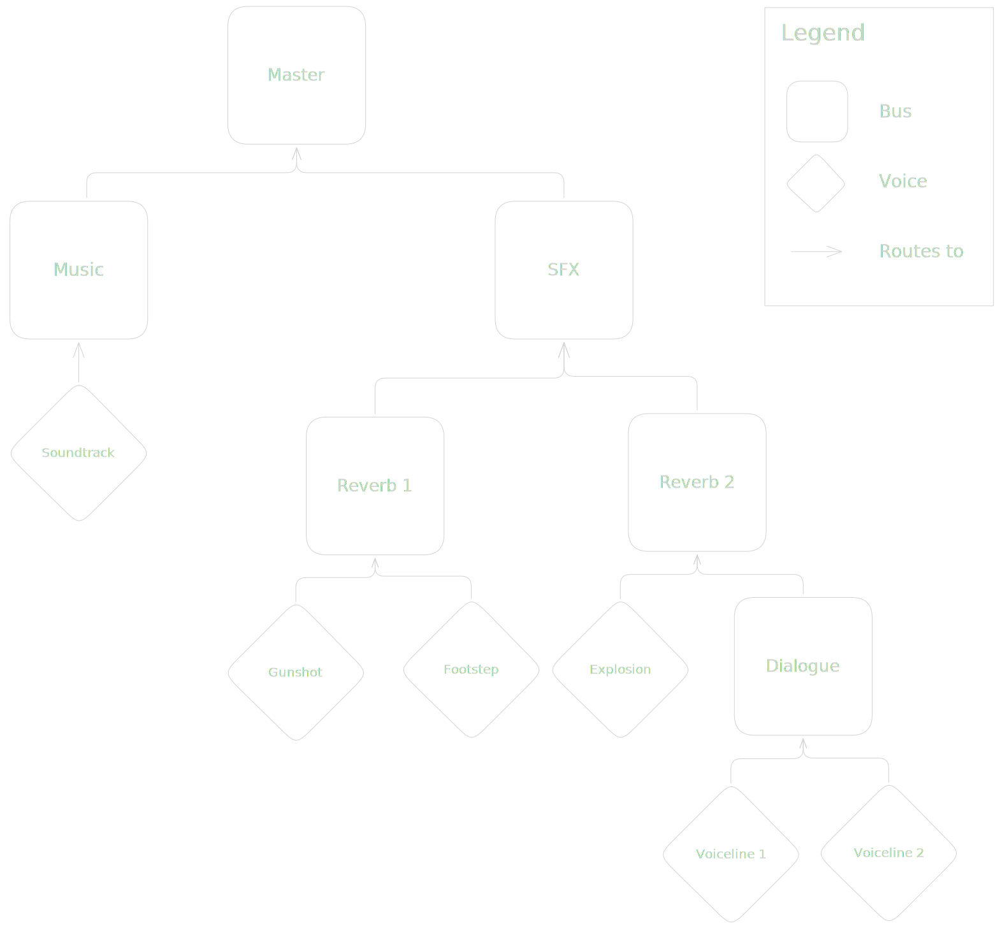
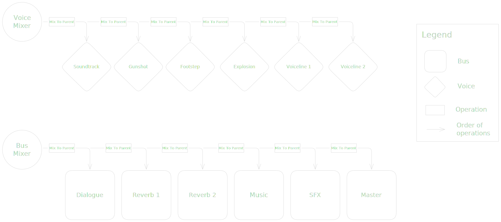

# Architecture

## Threading Model
DALIA uses splits its processing across four threads in total (one of them being the thread that the API is 
being called from). The engine delegates its workload to three internal subsystems. To do this efficiently without 
locking any of the priority threads (the API thread and the audio thread), DALIA makes use of lock-free queues 
for most of its inter-thread communication.

### Thread Boundary Diagram

The main **API Thread** is where `Engine::Update()` is called. It acts purely as a command dispatcher. When a
call to the engine is made, it is packaged into a command struct and pushed into a lock-free queue. When 
`Engine::Update()` is called, all commands accumulated since the last update call are dispatched to the other
threads for processing.

The **Audio Thread** (`RtSystem`) is a real-time, high-priority thread driven by the OS. This thread pops and processes 
commands of the command queue and renders the audio frame.

The **IO Streaming Thread** (`IoStreamSystem`) is a background worker thread that upon request, fills stream buffers 
with PCM data.

The **IO Loading Thread** (`IoLoadSystem`) is a background worker thread that upon request, opens and reads file 
handles and file data into memory.

## Engine Structure

### Class Diagram

To avoid the overhead of dynamic allocations during runtime, the engine pre-allocates all memory it will need during
`Engine::Init()`. All of this memory including the contiguous arrays (pools) that hold voices, buses, and assets is 
owned by a single, centralized `EngineInternalState` struct. The engine injects pointers to the pre-allocated
memory-pools into the three subsystems (`RtSystem`, `IoStreamSystem`, and `IoLoadSystem`) upon creation. The subsystems hold no state, they simply act on the memory
provided to them by the internal state.

## Mixing Graph
The core of DALIA's DSP pipeline is a Directed Acyclic Graph (DAG). In order to route audio dynamically, every node
(voice or bus) holds a reference (more specifically an index) to its parent node. 

### Mixing Hierarchy Diagram

This system is designed for CPU cache efficiency. The engine maintains a flat, topology sorted array of active nodes.
During an audio frame, the audio thread simply runs through this contiguous array, accumulating audio data into the
correct parent buffers. To achieve this, the engine intentionally trades memory for CPU performance by pre-allocating
intermediate buffers for every bus during initialization.

### Mixer Processing Diagram

Every audio frame is evaluated in two passes: The **Voice Pass** and the **Bus Pass**.
During the Voice Pass, the engine iterates over all active, playing voices. It reads their audio data and applies
transformations (volume, pitch, spatialization, and more), and mixes the output into their parent bus.
With the voice data fully accumulated, the Bus Pass runs through the topology sorted bus hierarchy. For each bus, it
processes any attached DSP effects, applies volume and mixes the output into its parent bus. This pass finishes when 
all output data is mixed into the Master output.